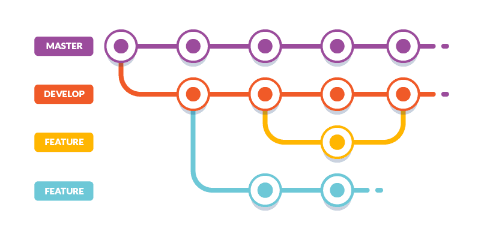

## Check out [Wiki page](https://github.com/princeelector/git-and-github-guide/wiki) for more condensed sources plus some theory

## Table of contents

- [Git commands](#git-commands)
  - [User configuration](#user-configuration)
  - [Repository setup](#repository-setup)
  - [Inspect & Compare](#inspect--compare)
  - [Tracking path changes](#tracking-path-changes)
  - [Staging & Snapshot](#staging--snapshot)
  - [Branches & Merging](#branches--merging)
  - [Remote Repositories](#remote-repositories)
  - [Rewrite history](#rewrite-history)
  - [Temporary commits](#temporary-commits)
- [Git workflow](#git-workflow)
  - [Basic](#basic)
  - [Feature Branch](#feature-branch)
    - [Feature Branch and Merge/Pull requests](#feature-branch-and-mergepull-requests)
  - [Gitflow](#gitflow)
  - [Forking workflow](#forking-workflow)
- [Ignoring files](#ignoring-files)
- [Committing guideline](#committing-guideline)
- [Using GitHub](#using-github)
- [Working in a Team](#working-in-a-team)

# Git commands

## User configuration

- `git config --global user.name '[firstname lastname]'` - Set a name for identification. Hint: You can use `-g` flag instead of `--global`

- `git config -g user.email '[valid_email]'` - Set associated email address.

- `git config -g color.ui auto` - Set automatic command line coloring for Git for easy reviewing.

## Repository setup

- `git init` - Initialize an existing directory as a Git repository.

- `git clone [url]` - Retrieve an entire repository from a hosted location via URL.

## Inspect & Compare

- `git log` - Show the commit history for the currently active branch.

- `git log branchB..branchA` - Show the commits on branchA that are not on branchB.

- `git log --follow [file]` - Show the commits that changed file, even across renames.

- `git diff branchB..branchA` - Show difference of what is in branchA that is not in branchB.

- `git show [SHA]` - Show any object in Git in human-readable format.

## Tracking path changes

- `git rm [file]` - Delete the file from project and stage the removal for commit.

- `git mv [existing_path] [new_path]` - Change an existing file path and stage the move.

- `git log --stat -M` - Show all commit logs with indication of any paths that moved.

## Staging & Snapshot

- `git status` - Show modified files in working directory, staged for next commit.

- `git add [file]` - Add a file as it looks now to staging area for your next commit. Use `git add .` to add all files.

- `git reset [file]` - Unstage a file while retaining changes in working directory.

- `git diff` - Difference of what is changed but not staged.

- `git diff --staged` - Difference of what is staged but not yet committed.

- `git commit -m [commit_message]` - Commit your staged content as a new commit snapshot.

- `git revert [commit]` - Create new commit that undoes all of the changes made in `[commit]`, then
  apply it to the current branch.

- `git clean -n` - Shows which untracked files would be removed from working directory.
  Use the `-f` flag in place of the `-n` flag to execute the clean.

## Branches & Merging

- `git branch` - List your branches. `a*` will appear next to currently active branch.

- `git branch [branch_name]` - Create a new branch at the current commit.

- `git checkout [branch_name]` - Switch to another branch and check it out into your working directory.
  Use `-b` flag to create and check out a new branch.

- `git branch -d [branch_name]` - Delete branch.

- `git merge [branch]` - Merge the specified branch's history into the current one.

- `git log` - Show all commits in the current branch's history.

## Remote Repositories

- `git remote add [remote_alias] [url]` - add a git URL as an alias.

- `git fetch [remote_alias]` - fetch down all the branches from that Git remote.

- `git merge [remote_alias]/[branch]` - Merge a remote branch into your current branch to bring it up to date.

- `git push [remote_alias] [branch]` - Transmit local branch commits to the remote repository branch.

- `git push --force` - Overwrite remote repository with local working directory.

- `git pull` - Fetch and merge any commits from the tracking remote branch.

## Rewrite history

- `git commit --amend` - Replace the last commit with staged changes and last commit combined. Use with
  nothing staged to edit commit's message.

- `git rebase [branch]` - Apply any commits of current branch ahead of specified one.

- `git reset --hard [commit]` - Clear staging area, rewrite working tree from specified commit.

- `git rm --cached [file]` - Stop tracking specified file.

- `git reflog` - Show a log of changes to the local repository's HEAD. Add `--all` to show all refs.

## Temporary commits

- `git stash` - Save modified and staged changes.

- `git stash list` - List stack-order of stashed file changes.

- `git stash pop` - Write working from top of stash stack.

- `git stash drop` - Discard the changes from top of stash stack.

# Git workflow

## Basic

The most popular workflow among entry-level developers and in small projects.

The idea is simple: there is one central repository. Developers clones the repo, works
locally on the code, makes a commit with changes, and pushes it to the central repository
for other developers to pull and use in their work.

## Feature Branch

The basic workflow is great for developing a simple project. However, once two or more developers
start working on separate functionalities within one project, problems begin to appear.

Let’s say one of the developers has finished their functionality and wants to release it.
However, they cannot do that because the second feature isn’t ready. Making a release at
this moment could result in messing everything up, to say the least.

This is where branches - the core feature of Git - come in handy. Branches are independent
“tracks” of developing a project. For each new functionality, a new branch should be created,
where the new feature is developed and tested. Once the feature is ready, the branch can be
merged to the master branch so it can be released to LIVE.

### Feature Branch and Merge/Pull requests

The feature branch workflow assumes that all developers on the team have equal knowledge
and position. In bigger teams, however, there’s always some form of hierarchy (Junior vs Senior)
In this case, you can employ merge requests and push permissions.

Before a branch is merged to master, it needs to be verified and checked for errors.
Junior developers can create a merge request and assign it to one of the Seniors, so
they can review the code and leave comments. If everything’s okay, the request is
accepted and the branch is merged.

Merge requests can be combined with push permissions that allow to restrict pushing
changes to specific branches in the repository, so you can keep full control over the code.

## Gitflow

The bigger the project, the more control you need over what and when is released.
Your projects require more unit and integration tests, which are now counted in hours.
Usually, you don’t run such tests on branches where features are developed.

This can be resolved with Gitflow, which employs two parallel long-running branches:
- Master
- Develop

`“Master”` is always ready to be released on LIVE, with everything fully tested and approved
(production-ready). `“Develop”` is the branch to which all feature branches are merged and
where all tests are performed. Only when everything’s been thoroughly checked and fixed
it can be merged to the Master.

## Forking workflow

In open source projects it is the owner of the repository who decides who can push to the repo.
However, the idea of open source is that everybody can contribute to the project. Still,
it’s hard to think of Linus Torvalds giving unlimited repository access to the Linux project
to anyone who’d like to change or improve its code.

This problem is solved by forks: any time a developer wants to change something in
an open source project, they don’t clone the official repo directly. Instead, they
`fork` it to create a copy. When the work is finished, they make a pull request so
that the owner of the repository can review the changes and decide whether to merge
them to his project.

At its core forking is similar to feature branching, but instead of creating branches
a fork of the repo is made, and instead of doing a merge request you create a pull request.

# Ignoring files

# Committing guideline

# Using GitHub

# Working in a Team
