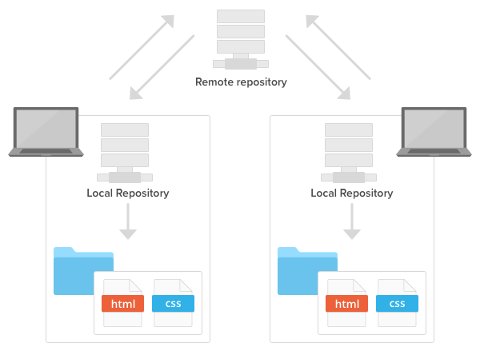

## Table of contents

- [Create a repository](#create-a-repository)
  - [Creating a local repository](#creating-a-local-repository)
  - [Cloning an existing repository](#cloning-an-existing-repository)
  - [Creating a remote repository](#creating-a-remote-repository)
    - [Pick a name for your repository](#pick-a-name-for-your-repository)
    - [Other options](#other-options)
    - [Connect a local repository to a remote repository](#connect-a-local-repository-to-a-remote-repository)
- [Git commands](#git-commands)
  - [User configuration](#user-configuration)
  - [Aliases](#aliases)
  - [Repository setup](#repository-setup)
  - [Inspect & Compare](#inspect--compare)
  - [Tracking path changes](#tracking-path-changes)
  - [Staging & Snapshot](#staging--snapshot)
  - [Branches & Merging](#branches--merging)
  - [Remote Repositories](#remote-repositories)
  - [Rewrite history](#rewrite-history)
  - [Temporary commits](#temporary-commits)
- [Git workflow](#git-workflow)
  - [Basic](#basic)
  - [Feature Branch](#feature-branch)
    - [Feature Branch and Merge/Pull requests](#feature-branch-and-mergepull-requests)
  - [Gitflow](#gitflow)
  - [Forking workflow](#forking-workflow)
    - [How to update a forked repo](#how-to-update-a-forked-repo)
- [Ignoring files](#ignoring-files)
  - [Example of a .gitignore file](#example-of-a-gitignore-file)
  - [Files to ignore](#files-to-ignore)
  - [How .gitignore works](#how-gitignore-works)
    - [Literal File Names](#literal-file-names)
    - [Directories](#directories)
    - [Wildcard](#wildcard)
    - [Negation](#negation)
    - [Double Asterisk](#double-asterisk)
    - [Comments](#comments)
- [Committing guideline](#committing-guideline)
  - [Use Branches](#use-branches)
  - [Staging and commiting](#staging-and-commiting)
  - [Committing best practices](#committing-best-practices)
    - [Make clean, single-purpose commits](#make-clean-single-purpose-commits)
    - [Write good commit messages](#write-good-commit-messages)
    - [Don't commit half-done work](#dont-commit-half-done-work)
    - [Test before you commit](#test-before-you-commit)
- [Using GitHub](#using-github)
  - [GitHub flow](#github-flow)
    - [Create a branch](#create-a-branch)
    - [Commit changes](#commit-changes)
    - [Open a Pull Request](#open-a-pull-request)
    - [Discuss and review your code](#discuss-and-review-your-code)
    - [Merge](#merge)
  - [Issues](#issues)
  - [Wiki](#wiki)
    - [Adding content](#adding-content)
    - [Adding pages](#adding-pages)
- [Markdown for README files](#markdown-for-readme-files)
  - [Headings](#headings)
  - [Styling text](#styling-text)
  - [Lists](#lists)
    - [Unordered list](#unordered-list)
    - [Ordered list](#ordered-list)
    - [Nested lists](#nested-lists)
    - [Task lists](#task-lists)
  - [Links](#links)
  - [Images](#images)
  - [Quotes](#quotes)
  - [Horizontal Rule](#horizontal-rule)
  - [Code and Syntax Highlighting](#code-and-syntax-highlighting)
    - [Inline code](#inline-code)
    - [Code blocks](#code-blocks)
  - [Tables](#tables)
  - [Emoji](#emoji)
- [Other sources](#other-sources)

# Create a repository

A Git repository is a virtual storage of your project. It allows you to save versions of your code,
which you can access when needed. There are two types of Git repositories: **remote** and **local**.

- A **remote repository** is hosted on a remote, or off-site, server that is shared among multiple team members.
- A **local repository** is hosted on a local machine for an individual user.



## Creating a local repository

To create a new repo, you'll use the `git init` command. `git init` is a one-time command you use during
the initial setup of a new repo. Executing this command will create a new *.git* subdirectory in your
current working directory. This will also create a new master branch.

## Cloning an existing repository

If a project has already been set up on a remote repository, the `git clone [url]` command is the most
common way for users to obtain a local development clone. Like `git init`, cloning is generally a one-time
operation. Once a developer has obtained a working copy, all version control operations are managed through
their local repository.

## Creating a remote repository

Just as with a local repository, you can create a remote repository that will be hosted by GitHub.
Having a remote repository lets you show off your work to other people and even invite other developers
to collaborate on an interesting project.

### Pick a name for your repository

While naming a GitHub repo you want a name that is brief, descriptive and readable. Although there is no wrong
way to name a repo, some names are better than others. The following rules are considered best practices while naming
your repositories:

1. Use lower case.
2. Use dashes `-` (kebab-case).
3. Be specific. You may find you have to differentiate between similar ideas later.
4. Be consistent.

Examples:

- mybrandnewrepository :x: - Avoid concatenating couple words into one
- myBrandNewRepository :x: - camelCase is not a good use case for naming repositories
- my-brand-new-repository :heavy_check_mark: - kebab-case is clear and readable

### Other options

There are a number of optional items you can pre-populate your repository with. You can change any of them
even after your repository has been created. Having a README and LICENCE files is considered a good practice,
but you can create them later as well. You also can choose to make your repository public or private. If you're
using GitHub Free for a user account or organization and change a repository's visibility from public to private,
you'll lose access to many features like protected branches or GitHub Pages.


### Connect a local repository to a remote repository

In the Command prompt, add the URL for the remote repository where your local repository will be pushed.

`git remote add origin [remote_repository_URL]`

See [Git commands](#git-commands) below for a detailed list of all Git commands.

```bash
git remote add origin [remote_repository_URL] # sets the new remote
git remote -v # verifies the new remote URL
git push -u origin master # pushes the changes in your local repository up to the remote repository
```

# Git commands

## User configuration

- `git config --global user.name '[firstname lastname]'` - Set a name for identification.
  Hint: You can use the `-g` flag instead of the `--global`

- `git config -g user.email '[valid_email]'` - Set associated email address.

- `git config -g color.ui auto` - Set automatic command line coloring for Git for easy reviewing.

## Aliases

- `git config --global alias.[alias_name] '[command_to_alias]'` - Set an alias for specified command. It is then invoked by `git [alias_name]`

- `alias [alias_name]='[command_to_alias]'` - Simplified alias setting. Alias is then invoked by simply typing `[alias_name]`

- `git config --get-regexp ^alias\.` - Get a list of all saved aliases.

- `git config --global --unset alias.[alias_name]` - Delete saved alias.

## Repository setup

- `git init` - Initialize an existing directory as a Git repository.

- `git clone [url]` - Retrieve an entire repository from a hosted location via URL.

## Inspect & Compare

- `git log` - Show the commit history for the currently active branch.

- `git log branchB..branchA` - Show the commits on **branchA** that are not on **branchB**.

- `git log --follow [file]` - Show the commits that changed file, even across renames.

- `git diff branchB..branchA` - Show difference of what is in **branchA** that is not in **branchB**.

- `git show [SHA]` - Show any object in Git in human-readable format.

## Tracking path changes

- `git rm [file]` - Delete the file from project and stage the removal for commit.

- `git mv [existing_path] [new_path]` - Change an existing file path and stage the move.

- `git log --stat -M` - Show all commit logs with indication of any paths that moved.

## Staging & Snapshot

- `git status` - Show modified files in working directory, staged for next commit.

- `git add [file]` - Add a file as it looks now to staging area for your next commit. Use `git add .` to add all files.

- `git reset [file]` - Unstage a file while retaining changes in working directory.

- `git diff` - Difference of what is changed but not staged.

- `git diff --staged` - Difference of what is staged but not yet committed.

- `git commit -m [commit_message]` - Commit your staged content as a new commit snapshot.

- `git revert [commit]` - Create new commit that undoes all of the changes made in `[commit]`, then
  apply it to the current branch.

- `git clean -n` - Shows which untracked files would be removed from working directory.
  Replace the `-f` flag with the `-n` flag to execute the clean.

## Branches & Merging

- `git branch` - List your branches. `a*` will appear next to currently active branch.

- `git branch [branch_name]` - Create a new branch at the current commit.

- `git checkout [branch_name]` - Switch to another branch and check it out into your working directory.
  Use `-b` flag to create and check out a new branch.

- `git branch -d [branch_name]` - Delete a branch.

- `git branch | grep -v 'master' | xargs git branch -D` - Delete all branches except the master branch.

- `git branch -m [new_branch_name]` - Rename current branch with name specified after `-m` flag

- `git merge [branch_name]` - Merge the specified branch's history into the current one.

- `git log` - Show all commits in the current branch's history.

## Remote Repositories

- `git remote add [remote_alias] [url]` - Connect your local repository to a remote repository.

- `git fetch [remote_alias]` - Fetch down all the branches from that Git remote.

- `git merge [remote_alias]/[branch_name]` - Merge a remote branch into your current branch to bring it up to date.

- `git merge --abort` - Aborts merging process.

- `git push` - Transmit local branch commits to the remote repository branch.

- `git push -u [remote_alias] [branch_name]` - Transmit local, non-master branch commits to the remote repository as a
  new branch. `-u` stands for `--set-upstream`. You can also use `origin` instead of `[remote_alias]`.

- `git push --force` - Overwrite remote repository with local working directory.
:warning: Command not recommended for beginners.

- `git pull` - Fetch and merge any commits from the tracking remote branch.

## Rewrite history

- `git commit --amend` - Replace the last commit with staged changes and last commit combined. Use with
  nothing staged to edit commit's message.

- `git rebase [branch_name]` - Apply any commits of current branch ahead of specified one.

- `git reset --hard [commit]` - Clear staging area, rewrite working tree from specified commit. Most often
  used with `HEAD`, which points on the latest commit.
  :warning: DANGEROUS: If `[commit]` is not specified Git will clear all of the working tree.

- `git rm --cached [file]` - Stop tracking specified file.

- `git reflog` - Show a log of changes to the local repository's HEAD. Add `--all` to show all refs.

## Temporary commits

- `git stash` - Save modified and staged changes.

- `git stash list` - List stack-order of stashed file changes.

- `git stash pop` - Write working from top of stash stack.

- `git stash drop` - Discard the changes from top of stash stack.

# Git workflow

## Basic


The most popular workflow among entry-level developers and in small projects.

The idea is simple: there is one central repository. Developer clones the repo, works
locally on the code, makes a commit with changes, and pushes it to the central repository
for other developers to pull and use in their work.

## Feature Branch


The basic workflow is great for developing a simple project. However, once two or more developers
start working on separate functionalities within one project, problems begin to appear.

Let’s say one of the developers has finished their functionality and wants to release it.
However, they cannot do that because the second feature isn’t ready. Making a release at
this moment could result in messing everything up, to say the least.

This is where branches - the core feature of Git - come in handy. Branches are independent
“tracks” of developing a project. For each new functionality, a new branch should be created,
where the new feature is developed and tested. Once the feature is ready, the branch can be
merged to the master branch so it can be released to LIVE.

### Feature Branch and Merge/Pull requests

The feature branch workflow assumes that all developers on the team have equal knowledge
and position. In bigger teams, however, there’s always some form of hierarchy (Junior vs Senior)
In this case, you can employ merge requests and push permissions.

Before a branch is merged to master, it needs to be verified and checked for errors.

Junior developers can create a **pull/merge request** and assign it to one of the Seniors, so
they can review the code and leave comments. If everything’s okay, the request is
accepted and the branch is merged.

Merge requests can be combined with push permissions that allow to restrict pushing
changes to specific branches in the repository, so you can keep full control over the code.

## Gitflow


The bigger the project, the more control you need over what and when is released.
Your projects require more unit and integration tests, which are now counted in hours.
Usually, you don’t run such tests on branches where features are developed.

This can be resolved with Gitflow, which employs two parallel long-running branches:

- **Master**
- **Develop**

**“Master”** is always ready to be released on LIVE, with everything fully tested and approved
(production-ready). **“Develop”** is the branch to which all feature branches are merged and
where all tests are performed. Only when everything’s been thoroughly checked and fixed
it can be merged to the Master.

## Forking workflow


In **open source** projects it is the owner of the repository who decides who can push to the repo.

However, the idea of open source is that everybody can contribute to the project. Still,
it’s hard to think of Linus Torvalds giving unlimited repository access to the Linux project
to anyone who’d like to change or improve its code.

This problem is solved by forks: any time a developer wants to change something in
an open source project, they don’t clone the official repo directly. Instead, they
**Fork** it to create a copy. When the work is finished, they make a pull request so
that the owner of the repository can review the changes and decide whether to merge
them to his project.

At its core forking is similar to feature branching, but instead of creating branches
a fork of the repo is made, and instead of doing a merge request you create a pull request.

### How to update a forked repo

Add the remote (original repo that you forked) and call it “upstream”

```console
git remote add upstream https://github.com/original-repo/goes-here.git
```

Fetch all branches of remote upstream

```console
git fetch upstream
```

Rewrite your master with upstream's master using git rebase

```console
git rebase upstream/master
```

Push your updates to master. You may need to force push with `--force` flag

```console
git push origin master --force
```

# Ignoring files

When you make commits in a git repository, you choose which files to stage and commit by
using `git add [file]` and `git commit`. But what if there are some files that you never
want to commit? It's too easy to accidentally commit them (especially if you use `git add .`
to stage all files in the current directory). That's where a **.gitignore** file comes in handy.
It lets Git know that it should ignore certain files and not track them.

Create a **.gitignore** file for your repository:

```console
touch .gitignore
```

`touch` - Command used to create files. To create a directory use `mkdir [directory_name]`

If you want to ignore a file that is already checked in, you must **untrack** the file before you
add a rule to ignore it. From your terminal, **untrack** the file:

```console
git rm --cached [file]
```

## Example of a .gitignore file

```bash
# Ignore the node_modules directory
node_modules/

# Ignore Logs
logs
*.log

# Ignore the build directory
/build

# The file containing environment variables
.env

# Ignore IDE specific files
.idea/
.vscode/
*.sw*
```

## Files to ignore

- Runtime files such as **log**, **lock**, **cache**, or temporary files
- Personal IDE **config** files
- Dependencies which can be downloaded from a package manager (e.g. **node_modules**)
- Files with API keys/secrets, credentials, or sensitive information
- Useless system files like **.DS_Store** on macOS
- Generated files like **build** folder
- Compiled code such as **.o**, **.pyc**, and **.class** files
- And there might be other files you would want to keep private (**.txt** or **todo.md** files)

You can get basic idea for what sort of files to ignore on [gitignore.io](https://gitignore.io),
by selecting your operating system, text editor or IDE, languages, and frameworks.

## How .gitignore works

A **.gitignore** file is a plain text file where each line contains a pattern for files/directories
to ignore. Generally, this is placed in the root folder of the repository. However, you can put it
in any folder in the repository and you can also have multiple **.gitignore** files. The patterns
in the files are relative to the location of that **.gitignore** file.

### Literal File Names

The easiest pattern is a literal file name, for example:

```bash
.DS_Store
```

This will ignore any files named `.DS_Store` which is a common file on macOS.

### Directories

You can ignore entire directories, just by including their paths and putting a `/` on the end:

```bash
node_modules/
logs/
```

If you leave the slash off of the end, it will match both files and directories with that name.

### Wildcard

The `*` matches 0 or more characters (except the `/`). So, for example, `*.log` matches any file
ending with the `.log` extension.

Another example is `*~`, which matches any file ending with `~`, such as `index.html~`

You can also use the `?`, which matches any one character except for the `/`.

### Negation

You can use a prefix of `!` to negate a file that would be ignored.

```bash
*.log
!example.log
```

In this example, `example.log` is not ignored, even though all other files ending with `.log` are ignored.

But be aware, you can't negate a file inside of an ignored directory:

```bash
logs/
!logs/example.log
```

Due to performance reasons, git will still ignore `logs/example.log` here because the entire `logs`
directory is ignored.

### Double Asterisk

`**` can be used to match any number of directories.

- `**/logs` matches all files or directories named logs (same as the pattern `logs`)
- `**/logs/*.log` matches all files ending with `.log` in a logs directory
- `logs/**/*.log` matches all files ending with `.log` in the logs directory and any of its subdirectories

`**` can also be used to match all files inside of a directory, so for example `logs/**` matches all
files inside of logs.

### Comments

Any lines that start with `#` are comments:

```bash
# macOS Files
.DS_Store
```

# Committing guideline

In Git, commit is the term used for saving changes. Git does not add changes to a commit automatically.
You need to indicate which file and changes need to be saved before running the Git commit command.
The commit command does not save changes in remote servers, only in the local repository of Git.

## Use Branches

**Branching** is one of Git’s most powerful features and this is not by accident: quick and easy branching
was a central requirement from day one. Branches are the perfect tool to help you avoid mixing up different
lines of development. You should use branches extensively in your development workflows: for new features,
bug fixes, experiments, ideas…

## Staging and commiting


- You make changes to a file in the **working directory**.
- You use the `git add` command to move those changes from the working directory to the **staging area**.
- Git does not save changes yet. You need to run the `git commit` command to move changes from the staging area to the **local repository**
- Local repository is updated, but if you want to update your **remote repository**, you need to `git push` it

## Committing best practices

Whether our code will be seen by the entire dev team, open source community or just future versions of
ourselves, either one will be grateful if we commit responsibly today. Time to forget about running
**~~`git commit -m 'Fix bug'`~~** ever again.

### Make clean, single-purpose commits

Let’s say you have two bugs that you just fixed. Each bug fix should produce a separate commit.
By doing that you are creating an **organized log of commits**, which makes it easy for other developers
to read and maintain the code base. It is a good practice to push code more often and not end up with
a messy repo. Make small commits more frequently and avoid committing large chunks of code.
This makes it easy to glance through the commit history and find what you are looking for.
It is recommended that the use of `git add .` and `git add -A` should be in moderation and instead
the focus should be on making **frequent, but meaningful commits**. On the other hand, commits which introduce
super small changes such as fixing typos in commit messages should be fixed with commands like
`git commit --amend` and not made into separate commit.

### Write good commit messages

Your commit log should tell a **story**. Therefore, Writing descriptive commit messages keeps your
repository well managed and makes it easy to navigate through your commit log. Your commit message
should be short, in present tense and explicitly say why you made the change.

It’s time to stop using bad commit messages like:

- "fixed a bug" :x:
- "changed a few things" :x:
- "removing method" :x:
- "more code refactoring" :x:

Use the **Imperative mood** instead of past tense style. Writing in the present tense tells someone **what
applying the commit will do**, rather than what you did. It may feel awkward at first to use the
imperative style and sometimes it can even be a bit awkward. In his article “How to Write a Git Commit Message”,
Chris Beams explains how to easily apply the imperative style:

> A properly formed Git commit subject line should always be able to complete the following sentence:
>
> "**If applied, this commit will** (your subject line here)"

If we apply this rule to the bad examples mentioned above, the result will look like this:

- If applied, this commit will -> "fix an X bug to enable Y" :heavy_check_mark:
- if applied, this commit will -> "remove an X method in Y" :heavy_check_mark:
- if applied, this commit will -> "refactor markup for X" :heavy_check_mark:
- if applied, this commit will -> "update content in X component" :heavy_check_mark:

The most important part of a commit message is that it should be clear and meaningful.
In the long run, writing good commit messages shows how much of a collaborator you are.
The benefits of writing good commit messages are not only limited to your team,
but indeed expand to yourself and future contributors.

### Don't commit half-done work

You should only commit code when it’s completed. This doesn’t mean you have to complete a whole,
large feature before committing. Quite the contrary: split the feature’s implementation into logical
chunks and remember to commit early and often. But don’t commit just to have something in the repository
before leaving the office at the end of the day. If you’re tempted to commit just because you need a clean
working copy (to check out a branch, pull in changes, etc.) consider using `git stash` feature instead.

### Test before you commit

Resist the temptation to commit something that you “think” is completed. Test it thoroughly
to make sure it really is completed and has no side effects (as far as one can tell).
While committing half-baked things in your local repository only requires you to forgive yourself,
having your code tested is even more important when it comes to pushing / sharing your code with others.

# Using GitHub

GitHub is a Git hosting repository that provides developers with tools to ship better code through
command line features, **issues** (threaded discussions), **pull requests**, **code review**, or the use of a
collection of free and for-purchase apps in the GitHub Marketplace. With collaboration layers like
the **GitHub flow**, and community of millions of developers, GitHub changes the way software is built.

## GitHub flow


GitHub builds collaboration directly into the development process. Work is organized into **repositories**,
where developers can outline requirements or direction and **set expectations** for team members. Then,
using the **GitHub flow**, which in its core is based on Git's [Gitflow](#gitflow) workflow,
developers simply create a branch to work on updates, commit changes to save them, open a pull request
to propose and discuss changes, and merge pull requests once everyone is on the same page.

### Create a branch

When you're working on a project, you're going to have a bunch of different **features** or ideas in progress
at any given time – some of which are ready to go, and others which are not. **Branching** exists to help you
manage this workflow.

When you create a branch in your project, you're creating an *environment where you can try out new ideas*.
Changes you make on a branch don't affect the `master` branch, so you're free to experiment and commit changes,
safe in the knowledge that your branch won't be merged until it's ready to be reviewed by someone you're
collaborating with.

```console
git checkout -b [branch_name]
```

### Commit changes

Once your branch has been created, it's time to start making changes. Whenever you **add**, **edit**, or **delete**
a file, you're making a commit, and adding them to your branch. This process of adding commits **keeps track** of your
progress as you work on a feature branch.

Commits also create a **transparent history** of your work that others can follow to understand what you've done
and why. Each commit has an associated commit message, which is a description explaining why a particular
change was made. Furthermore, each commit is considered a separate unit of change. This lets you roll back
changes if a bug is found, or if you decide to head in a different direction.

```console
git push -u origin [branch_name]
```

### Open a Pull Request


*Note:* After pushing local branch to the remote repository you may see that a `Compare & Pull request` button
has automatically appeared on its main page. You can use it instead of creating a Pull Request manually.

**Pull Requests** initiate discussion about your commits. Because they're tightly integrated with the underlying
Git repository, anyone can see exactly what changes would be merged if they accept your request.

You can open a Pull Request at any point during the development process: when you have little or no code but
want to share some screenshots or general ideas, when you're stuck and need help or advice, or when you're ready
for someone to review your work. By using GitHub's `@mention` system in your Pull Request message, you can ask
for feedback from specific people or teams, whether they're down the hall or ten time zones away.

### Discuss and review your code

Once a Pull Request has been opened, the person or team reviewing your changes may have questions or comments.
Perhaps the coding style doesn't match project guidelines, the change is missing unit tests, or maybe everything
looks great and props are in order. Pull Requests are designed to encourage and capture this type of conversation.

You can also continue to push to your branch in light of discussion and feedback about your commits.
If someone comments that you forgot to do something or if there is a bug in the code, you can fix it in your
branch and push up the change. GitHub will show your new commits and any additional feedback you may receive
in the unified Pull Request view.

### Merge


Once your changes have been verified, it is time to merge your code into the master branch.
Once merged, Pull Requests preserve a record of the historical changes to your code. Because
they're searchable, they let anyone go back in time to understand why and how a decision was made.

## Issues


Issues are a great way to keep track of tasks, enhancements, and bugs for your projects.
They’re kind of like email, except they can be shared and discussed with the rest of your team.
Most software projects have a bug tracker of some kind. GitHub’s tracker is called Issues,
and has its own section in every repository. A typical issue structure looks like this:

- A **title** and **description** describe what the issue is all about.
- Color-coded **labels** help you categorize and filter your issues (just like labels in email).
- A **milestone** acts like a container for issues. This is useful for associating issues with specific
  features or project phases (e.g. Weekly Sprint 9/5-9/16 or Shipping 1.0).
- One **assignee** is responsible for working on the issue at any given time.
- **Comments** allow anyone with access to the repository to provide feedback.

## Wiki


Every repository on GitHub comes with a wiki. After you’ve created a repository, you can set up the
included wiki through the sidebar navigation. Starting your wiki is simply a matter of clicking
the **Wiki** button and creating your first page.

### Adding content

Wiki content is designed to be easily editable. You can add or change content on any wiki page
by clicking the **Edit** button located in the upper right corner of each page. This opens up the wiki editor.

Wiki pages can be written in any format supported by GitHub Markup. Using the drop-down menu in the editor,
you can select the format of your wiki, and then use wiki toolbar to create and include content on a page.
Wikis also give you the option of including a custom footer where you can list things like contact details
or license information for your project.

GitHub keeps track of changes made to each page in your wiki. Below a page title, you can see who made
the most recent edits, in addition to the number of commits made to the page. Clicking on this information
will take you to the full page history where you can compare revisions or see a detailed list of edits over time.

### Adding pages

You can add additional pages to your wiki by selecting **New Page** in the upper right corner. By default,
each page you create is included automatically in your wiki’s sidebar and listed in alphabetical order.

# Markdown for README files

GitHub combines a syntax for formatting text called **GitHub Flavored Markdown** with a few unique writing features.

## Headings

```markdown
# H1
## H2
### H3
#### H4
##### H5
###### H6
```

**Output**:

- # H1

- ## H2

- ### H3

- #### H4

- ##### H5

- ###### H6

## Styling text

| Style | Syntax | Keyboard shortcut | Example | Output |
| :---: | :---: | :---: | :---: | :---: |
| Bold | `** **` or `__ __` | cmd/ctrl + b | `**This is bold text**` | **This is bold text** |
| Italic | `* *` or `_ _` | cmd/ctrl + i | `*This text is italicized*` | *This text is italicized* |
| Strikethrough | `~~ ~~` | | `~~This was mistaken text~~` | ~~This was mistaken text~~ |
| Bold and nested italic | `** **` and `_ _` | | `**This text is _extremely_ important**` | **This text is _extremely_ important** |
| All bold and italic | `*** ***` | | `***All this text is important***` | ***All this text is important*** |

## Lists

### Unordered list

```markdown
- Donald Trump
- Barack Obama
- Teddy Roosevelt
```

**Output**:

- Donald Trump
- Barack Obama
- Teddy Roosevelt

### Ordered list

```markdown
1. George Washington
2. John Adams
3. Thomas Jefferson
```

**Output**:

1. George Washington
2. John Adams
3. Thomas Jefferson

### Nested lists

```markdown
1. First item
    - Second item
      - Third item
```

**Output**:

1. First item
    - Second item
      - Third item

### Task lists

```markdown
- [x] Finish my changes
- [ ] Push my commits to GitHub
- [ ] Open a pull request
- [ ] \(Optional) Open a followup issue
```

**Output**:

- [x] Finish my changes
- [ ] Push my commits to GitHub
- [ ] Open a pull request
- [ ] \(Optional) Open a followup issue

## Links

```markdown
[Link](https://www.google.com)

[Link with a title](https://www.google.com "Google's Homepage")

URLs and URLs in angle brackets will automatically get turned into links.
<http://www.example.com> and sometimes example.com (but not on Github).
```

**Output**:

[Link](https://www.google.com)

[Link with a title](https://www.google.com "Google's Homepage")

URLs and URLs in angle brackets will automatically get turned into links.
<http://www.example.com> and sometimes example.com (but not on Github).

## Images

```markdown
Inline-style:


```

**Output**:


## Quotes

```markdown
One great man said:

> Preserve the Union

Break

> Blockquotes are very handy to cite sources or some person's words.
> This line is part of the same quote.

Another break

> Blockquotes are very handy to cite sources or some person's words.
>
> This line is part of the same quote, but it's in the same line as the previous sentence.
```

**Output**:

One great man said:

> Preserve the Union

Break

> Blockquotes are very handy to cite sources or some person's words.
> This line is part of the same quote.

Another break

> Blockquotes are very handy to cite sources or some person's words.
>
> This line is part of the same quote, but it's not in the same line as the previous sentence.

## Horizontal Rule

```markdown
Three or more...

---

Hypens

```

**Output**:

Three or more...

---

Hyphens

## Code and Syntax Highlighting

### Inline code

You can call out code or a command within a sentence with single backticks (` `` `)
The text within the backticks will not be formatted.

```markdown
Inline `code` has `back-ticks around` it.
```

**Output**:

Inline `code` has `back-ticks around` it.

### Code blocks

To format code or text into its own distinct block, use triple backticks (` ``` `)

```none
    ```
    No language indicated, so no syntax highlighting.
    But let's throw in a <b>tag</b>.
    ```

    ```javascript
    const message = 'Hello world from JavaScript!';
    console.log(message);
    ```

    ```python
    message = "Hello world from Python!"
    print message
    ```
```

**Output**:

```none
No language indicated, so no syntax highlighting.
But let's throw in a <b>tag</b>.
```

```javascript
const message = 'Hello world from JavaScript!';
console.log(message);
```

```python
message = "Hello world from Python!"
print message
```

You can find a full list of supported languages here: [CLICK](https://support.codebasehq.com/articles/tips-tricks/syntax-highlighting-in-markdown)

## Tables

```markdown
Colons can be used to align columns.

| Tables        | Are           | Cool  |
| ------------- |:-------------:| -----:|
| col 3 is      | right-aligned | $1600 |
| col 2 is      | centered      |   $12 |
| zebra stripes | are neat      |    $1 |

There must be at least 3 dashes separating each header cell.
The outer pipes (`|`) are optional, and you don't need to make the
raw Markdown line up prettily. You can also use inline Markdown.

Markdown | Less | Pretty
--- | --- | ---
*Still* | `renders` | **nicely**
1 | 2 | 3
```

**Output**:

Colons can be used to align columns.

| Tables        | Are           | Cool  |
| ------------- |:-------------:| -----:|
| col 3 is      | right-aligned | $1600 |
| col 2 is      | centered      |   $12 |
| zebra stripes | are neat      |    $1 |

There must be at least 3 dashes separating each header cell.
The outer pipes ( | ) are optional, and you don't need to make the
raw **Markdown** line up prettily. You can also use inline Markdown.

Markdown | Less | Pretty
--- | --- | ---
*Still* | `renders` | **nicely**
1 | 2 | 3

## Emoji

You can add emoji to your writing by typing `:EMOJICODE:`

Examples:

- :smiley: - `:smiley:`
- :heart: - `:heart`
- :trollface: - `:trollface:`
- :warning: - `:warning:`
- :x: - `:x:`
- :heavy_check_mark: - `:heavy_check_mark:`
- :zap: - `:zap:`
- :ok_hand: - `:ok_hand:`

You can find a full list of supported emoji's here: [CLICK](https://gist.github.com/rxaviers/7360908)

# Other sources

- [Git Documentation](https://git-scm.com/doc)
- [Using Git](https://help.github.com/en/github/using-git)
- [GitHub Documentation](https://help.github.com/en/github)
- [Become a Git pro in just one blog.](https://itnext.io/become-a-git-pro-in-just-one-blog-a-thorough-guide-to-git-architecture-and-command-line-interface-93fbe9bdb395)
- [The Ultimate GitHub Collaboration Guide](https://medium.com/@jonathanmines/the-ultimate-github-collaboration-guide-df816e98fb67)
- [Advanced Git Tutorials](https://www.atlassian.com/git/tutorials/advanced-overview)
- [GitHub Guides](https://guides.github.com)
